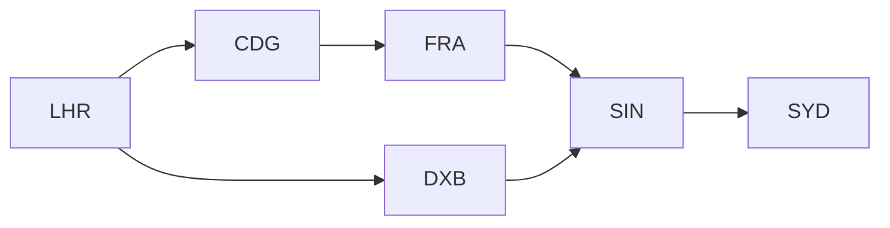

# Name: Transitive Closure (CLOSURE / RCLOSURE, or postfix ⁺ / *)

# Syntax:
CLOSURE  <from>, <to> (Edges)      -- R⁺: all pairs one or more hops apart
RCLOSURE <from>, <to> (Edges)      -- R*: also adds identity pairs (n, n)
Edges⁺ OVER (<from>, <to>)         -- same as CLOSURE  (⁺ = U+207A)
Edges*  OVER (<from>, <to>)        -- same as RCLOSURE

CLOSURE  <from> ↔ <to> (Edges)      -- read both ways (ASCII: <->)
Edges⁺ OVER (<from> ↔ <to>)         -- same, postfix

CLOSURE manager, report (OrgChart)

# Description:
Closure follows a relationship over and over until it can go no further, giving
you everything reachable. Over an edge relation like (parent, child) it computes
all ancestor/descendant pairs; over (manager, report) it gives the full
management chain; over (part, subpart) it gives a complete bill-of-materials
explosion. CLOSURE gives pairs that are one or more hops apart; RCLOSURE also
includes each node paired with itself.

# Technical Description:
Given a binary edge relation projected to two columns, CLOSURE computes R⁺ (the
transitive closure) and RCLOSURE computes R* (reflexive-transitive) under set
semantics via a semi-naïve least fixpoint. Cyclic graphs terminate because a
derived pair is never re-added. Output schema is the two edge columns. A row with
a null endpoint is not an edge and is skipped entirely, so neither end of it is a
node — which is what decides whether RCLOSURE pairs that value with itself. It does
not push down. Under `--provenance` it becomes a semiring-weighted closure
(reachability / path count / shortest path / cheapest-route).

# Examples:
All ancestor/descendant pairs from a parent→child edge list:
  CLOSURE parent, child (Family)

Everyone in a manager's chain of command:
  CLOSURE  <from> ↔ <to> (Edges)      -- read both ways (ASCII: <->)
Edges⁺ OVER (<from> ↔ <to>)         -- same, postfix

CLOSURE manager, report (OrgChart)

Reflexive — reachable nodes including the node itself:
  RCLOSURE src, dst (Network)

Everyone connected to everyone, ignoring who added whom:
  CLOSURE person ↔ friend (Friendships)

Postfix glyph form (identical result):
  Family⁺ OVER (parent, child)

Shortest path with weighted closure (run via the CLI):
  relix --provenance --semiring tropical --weight cost graph.relix

# Worked Example:
A small airline publishes its direct flights as an edge list. Travel planning
needs the *reachability* relation: from each origin, every destination you can get
to with any number of connections.

```relix
Flights := [
| origin | dest |
|--------|------|
| LHR    | CDG  |
| CDG    | FRA  |
| FRA    | SIN  |
| SIN    | SYD  |
| LHR    | DXB  |
| DXB    | SIN  |
];

Reachable := { CLOSURE origin, dest (Flights) };
```

The direct network:



`Reachable` adds every multi-hop pair. From LHR you can reach SYD two ways
(LHR→CDG→FRA→SIN→SYD and LHR→DXB→SIN→SYD) but the pair `(LHR, SYD)` appears just
once — closure runs under set semantics, so a derived pair is never re-added:

```relix
query { τ origin, dest (Reachable) };
```

```
 origin  dest
 ──────  ────
 CDG     FRA
 CDG     SIN
 CDG     SYD
 DXB     SIN
 DXB     SYD
 FRA     SIN
 FRA     SYD
 LHR     CDG
 LHR     DXB
 LHR     FRA
 LHR     SIN
 LHR     SYD
 SIN     SYD
(13 rows)
```

Thirteen pairs from six direct flights: the six edges themselves plus seven
derived ones. `LHR → FRA` is reached via CDG, `LHR → SIN` via either CDG/FRA or
DXB, and `LHR → SYD` is the full connecting itinerary. The `τ` sorts the output
for readability — closure itself yields a set, in no guaranteed order.

"Can I fly from LHR to Sydney at all?" is then a one-line selection:

```relix
CanReachSYD := { σ origin = "LHR" ∧ dest = "SYD" (Reachable) };
```

Swap `CLOSURE` for `RCLOSURE` to also include the zero-hop identity pairs
`(LHR, LHR)`, `(SYD, SYD)`, … — useful when "stay where you are" counts as a valid
itinerary.

# Optimization — endpoint pushdown (single-source reachability):
Computing the *all-pairs* closure just to keep one origin (or one destination) is
wasteful: the work for every other source is thrown away. When a selection fixes
an endpoint to a constant, the optimizer folds that equality **into** the operator
as a source/target bound, turning all-pairs reachability into single-source,
single-target, or single-pair traversal. This is the canonical *magic-sets /
sideways-information-passing* rewrite, recorded as `CLOSURE-001` on the
`relix-events` feed (visible via `--trace`):

```relix
-- All three of these read directly from the edge relation; after view inlining
-- the σ sits directly above the CLOSURE, so the bound is folded in.
FromLHR  := { σ origin = "LHR"  (CLOSURE origin, dest (Flights)) };  -- single-source
IntoSYD  := { σ dest   = "SYD"  (CLOSURE origin, dest (Flights)) };  -- single-target (reversed adjacency)
LhrToSyd := { σ origin = "LHR" ∧ dest = "SYD" (CLOSURE origin, dest (Flights)) };  -- single-pair
```

| Form                              | Pushed bound          | Work done                                   |
|-----------------------------------|-----------------------|---------------------------------------------|
| `σ origin = c`                    | source = c            | BFS seeded from `c` over forward edges      |
| `σ dest = c`                      | target = c            | BFS seeded from `c` over **reversed** edges |
| `σ origin = a ∧ dest = b`         | source = a, target = b| single-pair reachability check `a ⇝ b`      |

The rewrite is exact: `origin`/`dest` are *partitioning* dimensions, so the
all-pairs result filtered to `origin = c` is identical to seeding only from `c`.
Only top-level **equalities** on the endpoint columns against **literals** are
pushed; anything else (an inequality, a predicate on another column, `origin =
dest`) stays as a `σ` above the now-bounded closure, so the optimization can never
change the answer. The bound selects the graph's own nodes, by the same equality the
`σ` would have applied — so a literal of a type the nodes cannot be compared with
selects none of them, exactly as the `σ` would have kept no rows. The bound is shown in the physical plan, e.g.
`Closure origin→dest [origin="LHR"]` (use `--explain`).

# Limitations:
CLOSURE works on exactly two columns (a binary relation). For multi-column or
more general recursion use FIX. The result can be large on dense graphs; the
`--max-fixpoint-rounds` guard aborts runaway iteration.

With `--semiring tropical`, the weight column is read as a double and path costs
are summed with double arithmetic. That addition is exact for whole numbers below
2^53 — hop counts, whole-unit costs, distances in metres — and inexact for values
binary floating point cannot represent, which includes most decimals. The
practical effect is that a total cost can differ in its final bits depending on
the order edges were combined: `0.01 + 0.01 + 0.04` is `0.06` grouped one way and
`0.060000000000000005` grouped the other. The route chosen is unaffected unless
two routes are within one ulp of each other. Where an exact total matters, scale
the weight column to whole units first — cents rather than pounds — the way money
is normally stored.

# Alternatives:
FIX is the general monotone-recursion form (CLOSURE is its specialised, faster
two-column case). Composition (∘) is a single hop.

# See Also:
[fix](fix.md), [composition](../set-operations/composition.md), [natural-join](../joins/natural-join.md)

# Notes:
CLOSURE and RCLOSURE produce the same AST as the postfix ⁺ / * OVER forms; prefer
CLOSURE when the two-column form suffices — it uses a faster adjacency-indexed
loop than the general FIX.
