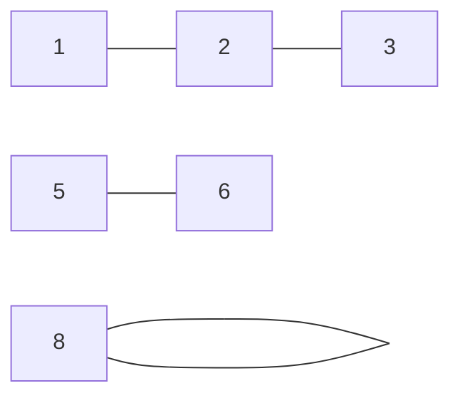

# Name: Connected Components (CLUSTER)

# Syntax:
CLUSTER <from>, <to> AS <label> (Edges)

CLUSTER src, dst AS island_id (NetworkTraffic)

# Description:
CLUSTER finds the "islands" in a graph: it groups together every node that is
connected — directly or through any chain of intermediate nodes — and stamps each
node with the id of the island it belongs to. It is the operator behind
fraud-ring detection, duplicate-account / entity resolution, and network
isolation, where the question is *"which of these things are tied together into
one cluster?"* — work that otherwise needs a hand-rolled recursive self-join.

# Technical Description:
Given an edge relation, CLUSTER reads the two named columns as **undirected**
edges (`from ↔ to` — direction is ignored) and computes the graph's connected
components by an in-engine union-find least fixpoint. The output is a binary
relation with one row per distinct node: the node identifier (keeping the
`from` column's name and type) plus a `NUMBER` component-label column named by
`AS <label>`. Labels are **canonical** — each component is assigned a dense,
1-based integer in ascending order of the component's minimum node id — so a
given graph always produces the same labels regardless of input row order.
A row with a null endpoint is **not an edge**, so it is skipped entirely: neither
end of it is a node, including the end that is present. A value that appears
only in such a row is therefore absent from the output rather than reported as
an island of its own — which would also have shifted every later label, since
the labels are dense. It is a blocking operator (it must see the whole edge
set) and never pushes down to a source.

# Examples:
Group all connected devices into isolated network islands:
  CLUSTER src, dst AS island_id (NetworkTraffic)

Resolve duplicate accounts linked by shared attributes:
  CLUSTER account_a, account_b AS entity_id (SharedSignals)

Find the components of an undirected friendship graph:
  CLUSTER person, friend AS community (Friendships)

# Worked Example:
A fraud team has a list of accounts linked by shared signals (same device, same
card, same address). Any two accounts in the same connected cluster are likely the
same actor. The link list is symmetric data — `a` linked to `b` is the same fact
as `b` linked to `a` — exactly what CLUSTER's undirected reading expects.

```relix
Links := [
| a | b |
|---|---|
| 1 | 2 |
| 2 | 3 |
| 5 | 6 |
| 8 | 8 |
];

Rings := { CLUSTER a, b AS ring_id (Links) };
```

The link graph has three islands — `{1,2,3}`, `{5,6}`, and the lone self-linked
`{8}`:



`Rings` labels every node with its component, numbered by ascending minimum node
id (so the `{1,2,3}` ring is `1`, `{5,6}` is `2`, `{8}` is `3`):

```relix
query { Rings };
```

```
 a  ring_id
 ─  ───────
 1        1
 2        1
 3        1
 5        2
 6        2
 8        3
(6 rows)
```

"How many distinct fraud rings, and how big is each?" is then an ordinary
aggregation over the labelled output:

```relix
RingSizes := { γ ring_id, COUNT(a) → members (Rings) };
```

# Limitations:
CLUSTER is **undirected** connectivity only — there is no directed
strongly-connected-components variant. It works on exactly two endpoint columns (a
binary edge relation). Isolated nodes that never appear in any edge do not appear
in the output (give them a self-edge `(n, n)` to surface them). Edge-weight /
minimum-cut variants are out of scope. The result can be large on dense graphs; as
a blocking operator it is subject to the boundedness check over unbounded inputs.

# Alternatives:
CLOSURE / RCLOSURE compute directed reachability (which nodes reach which) rather
than partitioning into components. FIX is the general monotone-recursion form for
recursions CLUSTER and CLOSURE do not cover.

# See Also:
[closure](closure.md), [fix](fix.md), [aggregation](../operators/group.md)

# Notes:
Component labels are deterministic (ordered by each component's minimum node id),
so two runs over the same data — in any row order — produce identical labels.
