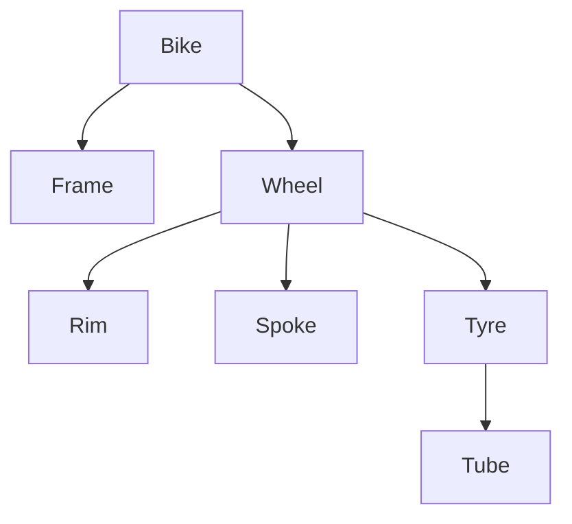

# Name: General Recursion (FIX)

# Syntax:
FIX <name> (<base>, <step>)

FIX Reach (
  π src, dst (Edges),
  π src, dst2 → dst (Reach ⋈ π src → dst, dst → dst2 (Edges))
)

# Description:
FIX is the general recursive query operator — the equivalent of SQL's WITH
RECURSIVE or a single Datalog rule. You give it a starting relation (the base)
and a rule that derives more rows from what it has so far (the step), and it
repeats the rule until nothing new appears. Use it for graph reachability,
hierarchy traversal, parts explosions, and any "keep expanding until done"
computation that a plain join can't express.

The recursive name is bound inside the step only and refers to "everything
computed so far".

# Technical Description:
FIX computes the least fixpoint of `step` seeded by `base`, under set semantics
(a derived row is never re-added). The step must be monotone (allowed: σ π ρ δ μ
and ⋈/⨝/×/⋉/∪/⊎/∩; forbidden: −, ÷, outer joins, γ, ∀, etc.) and linear (exactly
one occurrence of the bound name). Output schema = base schema; the step must be
union-compatible with the base. Evaluated by a semi-naïve loop.

Set semantics is what makes **cyclic data** terminate: going round a cycle
re-derives a row that is already held, so the round adds nothing and the loop
closes. That is a claim about cycles in the *data*, not a guarantee about every
query — see *Limitations*.

# Examples:
Transitive closure expressed as general recursion:
```relix
FIX Reach (
  π src, dst (Edges),
  π src, dst2 → dst (Reach ⋈ π src → dst, dst → dst2 (Edges))
)
```

Bill-of-materials explosion (all sub-components of an assembly).

Ancestor hierarchy from a parent edge.

# Worked Example:
A manufacturer stores its bill of materials as direct "assembly contains part"
edges. Procurement needs the full *explosion*: every component of a bike at any
depth, no matter how deeply nested.

```relix
Contains := [
| assembly | part   |
|----------|--------|
| Bike     | Frame  |
| Bike     | Wheel  |
| Wheel    | Rim    |
| Wheel    | Spoke  |
| Wheel    | Tyre   |
| Tyre     | Tube   |
];

-- (assembly, component) pairs at every depth
Explosion := { FIX BOM (
  Contains,
  π assembly, sub → part (BOM ⋈ ρ Edge(part, sub) (Contains))
) };
```

The nesting it walks:



How the step works: the bound name `BOM` is "everything found so far", with
columns `(assembly, part)`. Renaming `Contains` to `Edge(part, sub)` makes its
first column share the name `part`, so the natural join `BOM ⋈ Edge` links each
known `part` to the things *it* contains; the projection then re-labels the deeper
`sub` back to `part` so the step stays union-compatible with the base. Iterating
to a fixpoint yields the transitive parts list:

```relix
query { τ assembly, part (Explosion) };
```

```
 assembly  part
 ────────  ─────
 Bike      Frame
 Bike      Rim
 Bike      Spoke
 Bike      Tube
 Bike      Tyre
 Bike      Wheel
 Tyre      Tube
 Wheel     Rim
 Wheel     Spoke
 Wheel     Tube
 Wheel     Tyre
(11 rows)
```

Six direct edges become eleven (assembly, descendant) pairs. `Bike` gains `Rim`,
`Spoke` and `Tyre` via `Wheel`, and `Tube` two levels down via `Wheel → Tyre`; the
`τ` sorts the output for readability, since the fixpoint yields a set in no
guaranteed order.

"Everything I must order to build a bike" is then a selection:

```relix
BikeParts := { π part (σ assembly = "Bike" (Explosion)) };
```

This particular query is plain two-column reachability, so
`CLOSURE assembly, part (Contains)` gives the same answer more concisely — `FIX`
earns its keep when the step needs extra columns, a filter, or a join against
other relations on each round.

# Optimization — magic-sets pushdown (frozen columns, FIX-001):
Computing the *whole* fixpoint just to keep one slice of it is wasteful. When a
selection above a `FIX` constrains a **frozen** column — one the step carries
through *unchanged* from the recursive reference to its output, round after round —
the optimizer pushes that filter **into** the recursion: it seeds the base with it
*and* re-applies it to the recursive reference, so the fixpoint only ever derives
rows relevant to the bound. This is general *magic-sets / sideways-information-passing*,
recorded as `FIX-001` on the `relix-events` feed (visible via `--trace`):

```relix
-- After view inlining the σ sits directly above the FIX. `assembly` is frozen
-- (the step copies it straight from BOM), so the bound is folded into the recursion:
--   σ assembly = "Bike" (FIX BOM (Contains, π assembly, sub → part (BOM ⋈ …)))
--     ⇝ FIX BOM (σ assembly = "Bike" (Contains),
--                π assembly, sub → part (σ assembly = "Bike" (BOM) ⋈ …))
BikeParts := { π part (σ assembly = "Bike" (Explosion)) };
```

The explosion is now computed **only for the bike** instead of for every assembly
— an asymptotic, semantically exact win, and the generalisation of which
`CLOSURE`'s single-source pushdown is the two-column special case.

What is pushed: a top-level conjunct is folded in iff *every* column it references
is frozen (carried unchanged by the step), it references at least one column, and
it contains no function call. This is broader than `CLOSURE`'s equality-only rule —
ranges and `IN` over a frozen column push too. A conjunct on a column the step
*produces* anew each round (e.g. `part` above) is **not** frozen and stays as a
residual `σ` above the recursion, so the optimization can never change the answer.
The frozen-column analysis is conservative (it recognises σ/δ/π-passthrough/ρ and
inner joins where the column comes from the recursive side); anything it cannot
prove frozen is simply left un-optimised. Soundness rests on the step being linear
and monotone — exactly what `FIX` already requires.

# Limitations:
v1 supports linear recursion only (exactly one reference to the bound name in the
step). The step must be monotone — no difference, division, aggregation, or outer
joins inside it. For the common two-column reachability case CLOSURE is simpler
and faster.

**A FIX whose step computes new values may never finish.** The termination
argument above rests on the step *carrying values through* rather than making
them up: if every value it emits already appears somewhere in its inputs, there
are finitely many rows it could ever derive, so the loop must run out of new ones.
A step that computes breaks that. This one derives a row no round has seen before,
every round, forever:

```relix
Zero := [
| n |
|---|
| 0 |
];

query { FIX N (Zero, π n + 1 → m (N)) };
```

It is a well-formed FIX — linear, monotone, union-compatible — and nothing rejects
it, because "does this step invent values?" is a question about arithmetic rather
than about relational shape. NUMBER has no width limit, so the counter never wraps
round to a value already held.

This is not a corner case to avoid; it is the reason FIX exists as a general
operator rather than a spelling of CLOSURE. Counting paths, accumulating a cost,
building up a string, numbering rounds — all of them compute, and all of them are
worth writing. Whether such a query finishes depends on the query and the data,
and in general there is no way to answer it but to run it. Bound the ones you are
unsure of (see *Notes*).

The same applies one step further out: a `LATERAL` call inside a step passes column
values to a table-valued function, and a function that computes over its argument
invents values exactly as a projection does.

# Alternatives:
CLOSURE / RCLOSURE for binary transitive closure (the specialised, preferred form
when it suffices).

# See Also:
[closure](closure.md), [composition](../set-operations/composition.md), [natural-join](../joins/natural-join.md), [union](../set-operations/union.md)

# Notes:
Two caps turn a runaway recursion into a clear error instead of a hang, and both
are off unless you ask for them:

- `--max-fixpoint-rounds N` — how many rounds one FIX may iterate. Bounds recursion
  *depth*, so pick it from how deep you expect to go (a hierarchy's levels, a
  graph's diameter), not from the size of the answer.
- `--max-materialized-rows N` — how many rows one operator may hold. For a FIX that
  is everything it has derived so far, which is what a runaway recursion actually
  exhausts memory with.

Reach for the round cap when you know the shape of a terminating answer and want to
catch the case where you were wrong about it; reach for the row cap when you do not,
since it bounds the memory rather than the depth. Setting both is reasonable.
