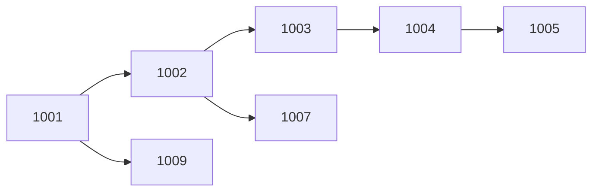

# Name: Bounded Path Reachability (PATH)

# Syntax:
PATH <from>, <to> HOPS <m> TO <n> AS <depth> (Edges)

PATH <from>, <to> HOPS <n> AS <depth> (Edges)      // shorthand for HOPS 1 TO n

PATH src_account, dst_account HOPS 1 TO 3 AS depth (Transfers)

# Description:
PATH answers *"what is reachable within N hops, and how far away is it?"* over a
directed graph. It is the bounded, distance-aware companion to CLOSURE: where
CLOSURE returns every reachable pair with no notion of distance, PATH returns only
the pairs connected by a path whose length falls inside an explicit hop window, and
stamps each with its shortest hop distance. It is the operator behind "accounts
within N transfer hops of a flagged account" (AML tracing), "people within 3
introductions" (networking), and "components within K dependency levels" (impact
analysis) — work that otherwise needs a `WITH RECURSIVE` CTE plus a depth guard.

# Technical Description:
Given an edge relation, PATH reads the two named columns as **directed** edges
(`from → to`) and performs an in-engine bounded breadth-first traversal over the
whole edge set. For every `(from, to)` pair connected by a directed path of length
`d` with `m ≤ d ≤ n`, it emits one row carrying both endpoints plus a `NUMBER`
distance column named by `AS <depth>`, where `d` is the **shortest** such length.
Because the distance is minimal, `(from, to)` is a candidate key of the result (no
pair appears at two depths). The single-bound form `HOPS n` is shorthand for
`HOPS 1 TO n`.

Output schema: the source-endpoint column (keeping the `from` name and type), the
target-endpoint column (keeping the `to` name and type), and the `depth` column.
A row with a null endpoint is not an edge and is skipped entirely, so neither
end of it is a node; cyclic graphs terminate because
the window caps the path length. It is a blocking operator (it must see the whole
edge set) and never pushes down to a source.

The start node is **not** baked into the operator. To scope a traversal to a
particular origin, compose an ordinary selection on the output — the RA-native way:

```relix
σ src = "1001" (PATH src, dst HOPS 1 TO 3 AS depth (Edges))
```

# Examples:
Accounts within 1–3 transfer hops of any account:
  PATH src_account, dst_account HOPS 1 TO 3 AS depth (Transfers)

People reachable in exactly 2 introductions:
  PATH person, contact HOPS 2 TO 2 AS hops (Knows)

Everything within 4 dependency levels:
  PATH module, dependency HOPS 4 AS levels (DependsOn)

# Worked Example:
An anti-money-laundering team wants every account reachable from a flagged mule
account (`1001`) within three transfer hops — the laundering chain. Accounts
further than three hops are out of scope for this review.

```relix
Transfers := [
| src_account | dst_account |
|-------------|-------------|
| 1001        | 1002        |
| 1001        | 1009        |
| 1002        | 1003        |
| 1002        | 1007        |
| 1003        | 1004        |
| 1004        | 1005        |
];

Reach := { PATH src_account, dst_account HOPS 1 TO 3 AS depth (Transfers) };
Trail := { π dst_account, depth (σ src_account = 1001 (Reach)) };
```

The money-flow graph downstream of `1001`:



`Trail` keeps the five accounts within three hops, each with its distance — `1005`
is four hops out and is correctly excluded:

```relix
query { τ depth, dst_account (Trail) };
```

```
 dst_account  depth
 ───────────  ─────
        1002      1
        1009      1
        1003      2
        1007      2
        1004      3
(5 rows)
```

Enriching with the account holders is then an ordinary join back to the accounts
relation:

```relix
Suspects := { π holder, bank, risk, depth (Accounts ⨝ account_id = dst_account Trail) };
```

# Limitations:
PATH is **directed** reachability. Edges are read `from → to`; for undirected
traversal, union the reversed edges into the input first. The output reports only
the shortest distance per pair, not every path length and not the route itself —
use TRACE for the optimal route, or CLUSTER for undirected connectivity. The hop
window must satisfy `1 ≤ m ≤ n`. The result can be large on dense graphs; as a
blocking operator it is subject to the boundedness check over unbounded inputs and
never pushes down to a source.

# Alternatives:
CLOSURE / RCLOSURE compute **unbounded** directed reachability (every reachable
pair, no distance). CLUSTER partitions an undirected graph into connected
components. TRACE returns the optimal (min/max-weight) route as an ordered node
sequence. FIX is the general monotone-recursion form underlying all of these.

# See Also:
[closure](closure.md), [cluster](cluster.md), [trace](trace.md), [fix](fix.md)

# Notes:
Output is ordered by `(from, to)` and is therefore reproducible regardless of input
row order.
