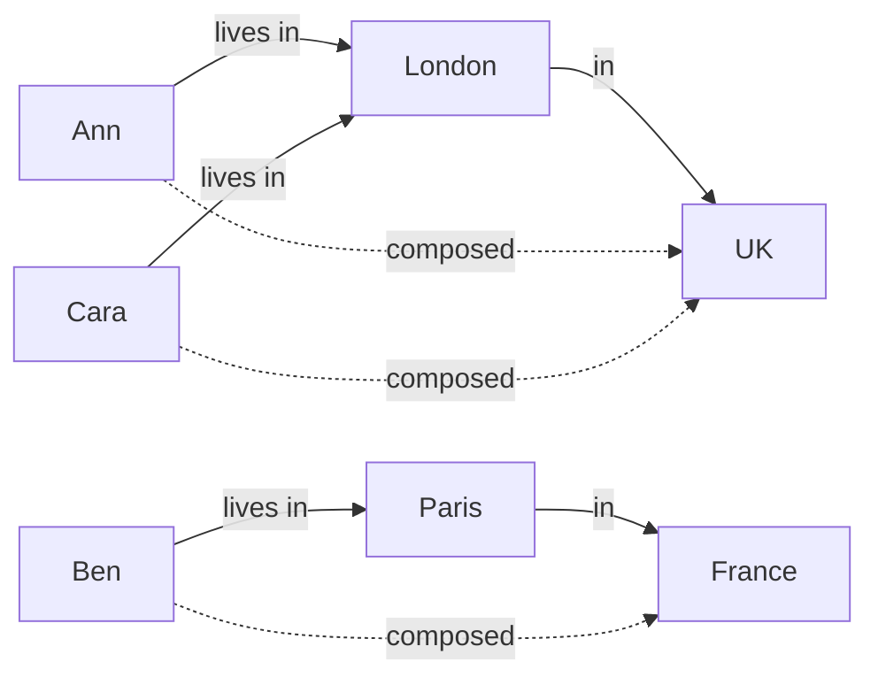

# Name: Composition (∘ / COMPOSE)

# Syntax:
Relation1 ∘ Relation2
Relation1 COMPOSE Relation2

Manages ∘ ρ M2(employee, report) (Manages)

# Description:
Composition joins two relations on the columns they share and then DROPS those
shared columns, keeping only the outer ends. The classic use is chaining
relationships: if `Manages(manager, employee)` says who manages whom, composing
it with itself links each manager to the people their reports manage — a
"manager → grand-report" relation, with the middle person removed.

# Technical Description:
R ∘ S natural-joins R and S on their shared columns and projects them away,
keeping the non-shared columns of both. The planner desugars it to
`π (non-shared) (R ⋈ S)`. Schema inference errors if the inputs share no column
or share every column. It does not push down.

# Examples:
Two-hop management chain (manager to their reports' reports):
  Manages ∘ ρ M2(employee, report) (Manages)

Friends-of-friends from a friendship edge relation:
  Friends ∘ ρ F2(friend, other) (Friends)

Compose a "lives in city" with "city in country" to get "person in country":
  LivesIn ∘ CityCountry

# Worked Example:
A directory knows which city each person lives in, and a separate table maps
cities to countries. Composition chains the two into a direct "person → country"
relation, dropping the intermediate city.

```relix
LivesIn := [
| person | city   |
|--------|--------|
| Ann    | London |
| Ben    | Paris  |
| Cara   | London |
];

CityCountry := [
| city   | country |
|--------|---------|
| London | UK      |
| Paris  | France  |
];

PersonCountry := { LivesIn ∘ CityCountry };
```

The shared column `city` is the hinge: it lines the two relations up, then gets
removed, leaving only the outer ends:



The result keeps `(person, country)` — `city` is gone:

```relix
query { PersonCountry };
```

```
 person  country
 ──────  ───────
 Ann     UK
 Ben     France
 Cara    UK
(3 rows)
```

If you compose a relation with *itself* — `Manages ∘ ρ M2(employee, report) (Manages)` over
`Manages(manager, employee)` — you get the two-hop "manager → grand-report"
relation. That is a single hop of composition; iterate it to all depths and you
have transitive closure (CLOSURE / FIX).

# Limitations:
Composition drops the shared columns, so its result heading depends on knowing
which they are. A schema-on-read input (JSON, HTTP, MongoDB) declares none, and
the operator is rejected there; project the relation into a declared heading
first.

The two relations must share at least one column but not all of them. For full
transitive reachability (any number of hops) use CLOSURE / FIX rather than a
single composition.

# Alternatives:
A natural join (⋈) keeps the shared columns; closure (CLOSURE) repeats the
relationship to all depths.

# See Also:
[natural-join](../joins/natural-join.md), [closure](../advanced/closure.md), [fix](../advanced/fix.md), [project](../operators/project.md)

# Notes:
A single composition is one hop; transitive closure is composition iterated to a
fixpoint.
